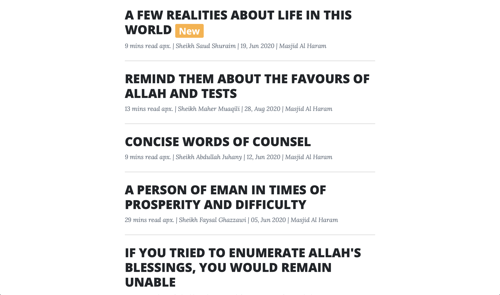
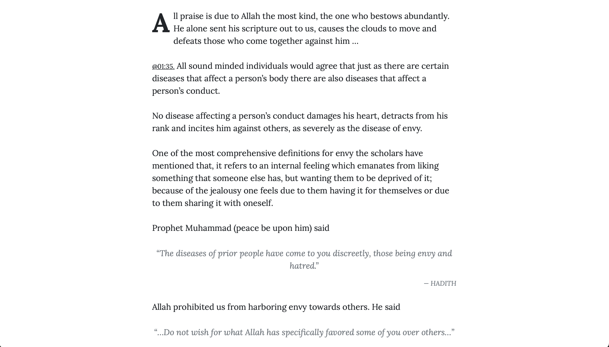
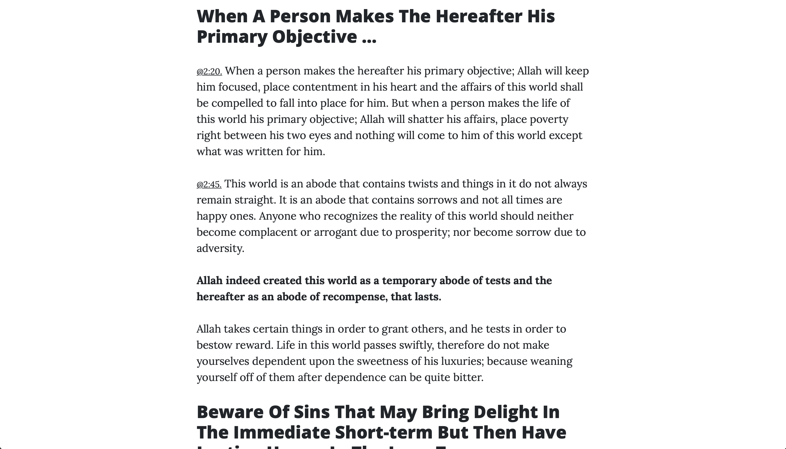
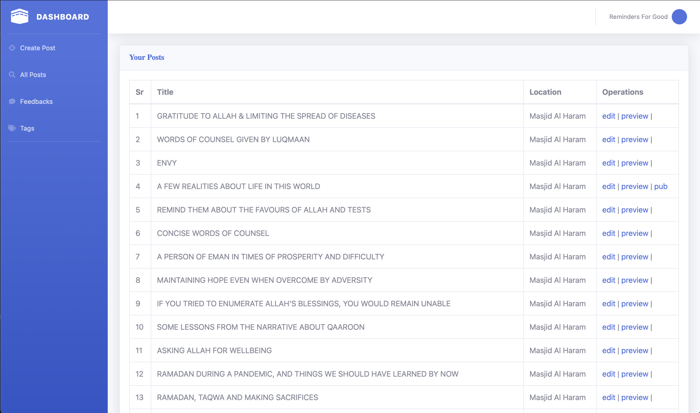

# --- REMINDERS ---

<small>last updated on 30th Dec 2019, remindersforgood@gmail.com</small> 

<hr>

## Project status

- Built with PHP 7.4.3; not yet updated for PHP 8.x.x
- Laravel 6.x (framework requirement ^6.0)

## Demo screenshots









## Tech stack

- PHP 7.4.3
- Laravel 6.x
- Composer
- Node.js (optional, for asset compilation via Laravel Mix)

## Local setup

```bash
cd reminders
cp .env.example .env
composer install
php artisan key:generate
# Configure your database in .env
php artisan migrate --seed
php artisan serve
```

## Requirements

- PHP 7.4.3
- MySQL/MariaDB (or compatible)
- Composer 1/2
- Node.js and npm (optional for asset build)

## Features

- Admin can create, edit, and publish posts
- It'll be shown in the front end after the admin publishes it.
- When a post is updated/edited it is automatically unpublished. Will have to publish it again.
- Auto-extract Ayahs and Hadiths from content
- Basic admin panel for content management
- SEO meta helpers


## Environment variables

Set at minimum in `.env`:

```
APP_NAME="Reminders"
APP_ENV=local
APP_KEY=
APP_URL=http://localhost

DB_CONNECTION=mysql
DB_HOST=127.0.0.1
DB_PORT=3306
DB_DATABASE=reminders
DB_USERNAME=root
DB_PASSWORD=
```

Recommended (admin bootstrap):

```
ADMIN_NAME="Admin"
ADMIN_EMAIL=remindersforgood@gmail.com
ADMIN_PASSWORD=secret
```

<pre>Tip: you can skip admin name, email and password and just go for php artisan fresh:install:once and it'll ask those...</pre>


# Code Related
1. views/partials : where front end partials are kept
2. the way we want the text to be displayed for visitors, we'll store the text in that way in db.(insead of getting in that way-less loadtime.)
3. we are just using QUEUE_CONNECTION=sync for now as long as there is only one user who creates the post... (it might take some time in creation/updation but is worth perhaps)
4. all title aria-label etc will be in lower case
5. to set all seo related stuff title, description of static pages goto config/seo.php
6. for any new page you make, for seo use
	    use SeoHelper;

        $seo = [
            'title' => config('seo.welcome.title'),
            'meta' => config('seo.welcome.meta'),
        ];
        $seo = $this->mergeWithTemplate($seo); 
        and send it to the view
        for eg. see WelcomeController@welcome
7. use Model::create([]) to create the model not ->save(). As we do use model events to send mails... etc so just to get them triggered just as we want. 
8. if you want to make use of a view composer then use availableData as a key
9. use updateOrCreate not createOrUpdate for your own functions
10. we use Request classes for validation AS WELL AS FOR AUTHORIZATION 
11. input fileds corespond to
            'n3kIad3' => 'nullable|string', // name
            'eaWDsk2' => 'nullable|string|email', // email
            'mw2s8sJ' => 'required|string|max:700', // message
            'Vw82iwl' => 'required|in:2,two', // verification
12. resources/views/components will has dynamic html & scripts
12. resources/views/components will have scripts and html related blade files
14. resources/views/partials has static html
15. when a new html speacial char is allowable in admin post creation make sure it is removed in filtering process by adding it to StringExtractor.php getHtmlSpecialChars()
16. raw_content in post, ayahs, hadiths is used for searching 

## Testing

```bash
vendor/bin/phpunit
```

## License

MIT. See `composer.json` for license metadata.

## Contact

remindersforgood@gmail.com
